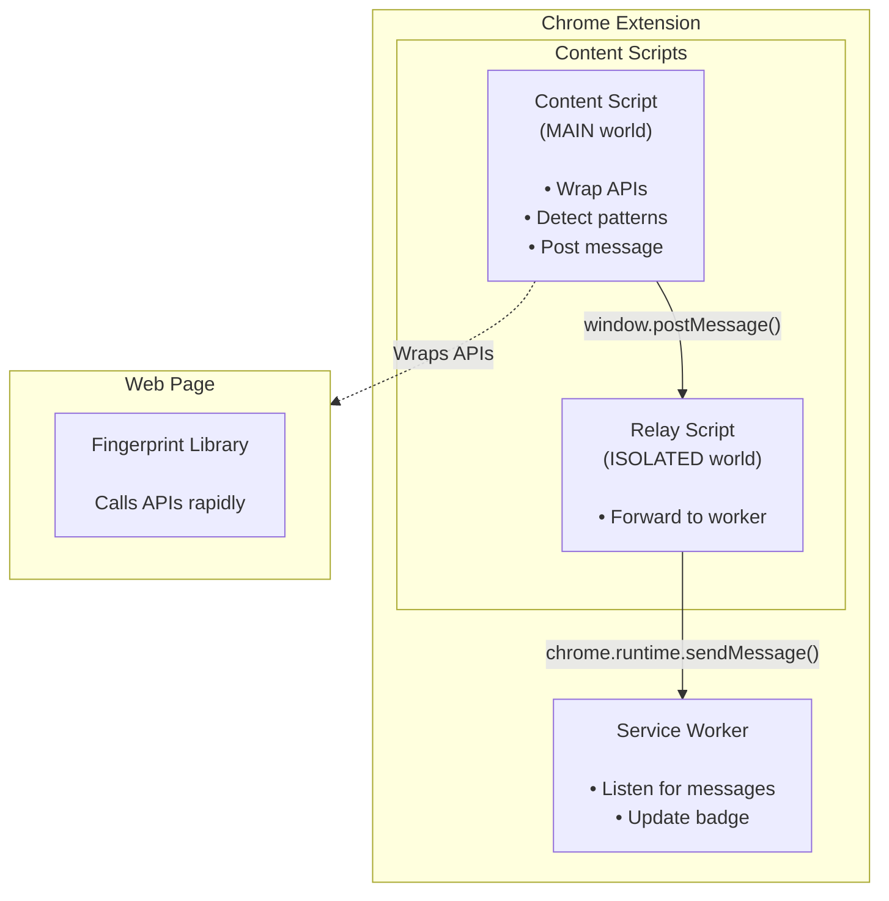
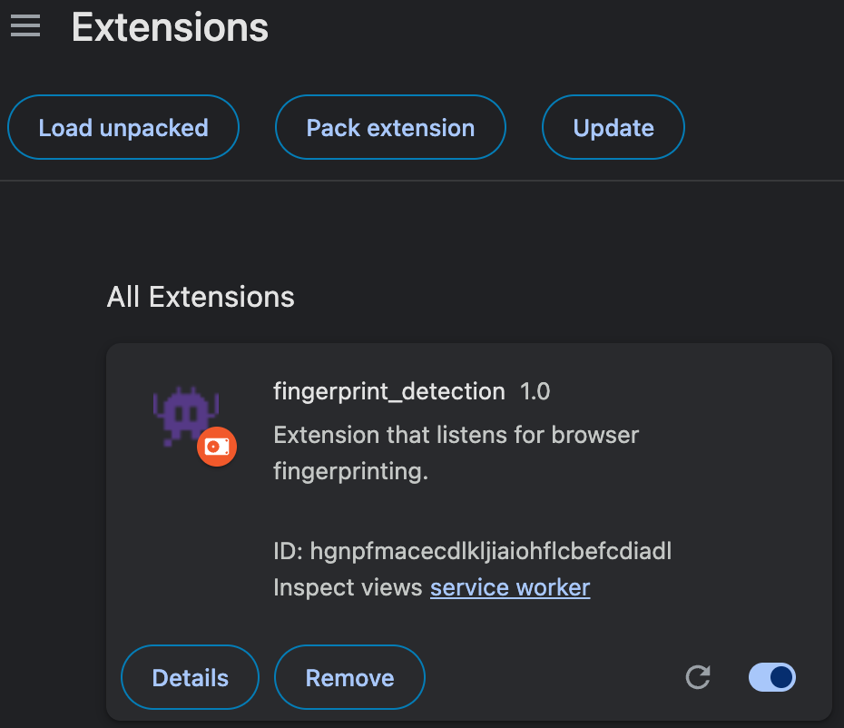
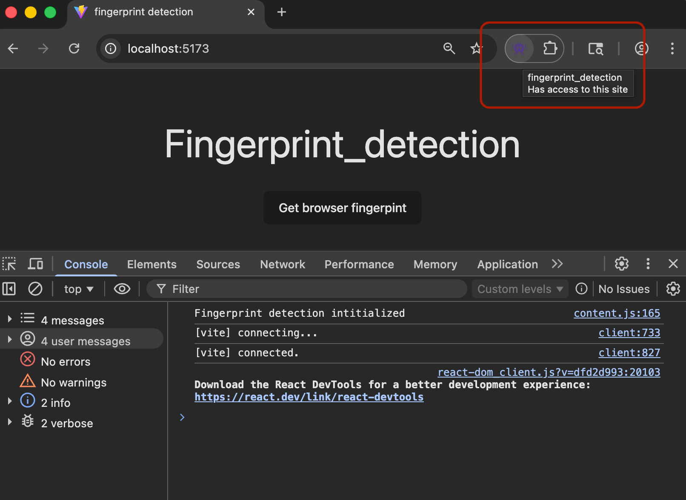
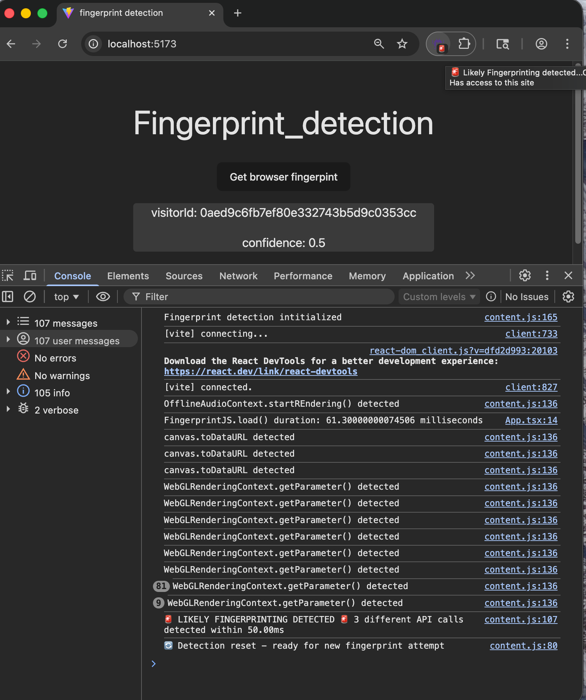

# Fingerprint Project

The purpose of this project was to play around with some browser fingerprinting technology as a learning exercise. I narrowed down the scope to two basic questions:

1. How does browser fingerprinting work?
2. Can it be detected?

The rest of this write-up describes the approach I took to implement a solution that attempts to answer those questions.

## FingerprintJS library

The specific library I chose to use is [**FingerprintJS**](https://github.com/fingerprintjs/fingerprintjs). It's an open-source, client-side browser fingerprinting library that creates unique visitor identifiers by collecting and hashing browser attributes.

I started with researching specific fingerprinting techniques. I found some decent articles on [fingerprint.com](https://fingerprint.com/blog/tag/engineering/) which provided a good intro to [canvas fingerprinting](https://fingerprint.com/blog/canvas-fingerprinting/) and [audio fingerprinting](https://fingerprint.com/blog/audio-fingerprinting/).
Next I spent some time looking at the **FingerprintJS** library. I made a local clone of the repo and then used [Claude Code](https://code.claude.com/docs/en/common-workflows#get-a-quick-codebase-overview) to get an overview of the structure. The 40+ entropy collection modules (canvas, fonts, WebGL, audio, etc.) live in the **src/sources/** directory.

## How does browser fingerprinting work?

To understand exactly what fingerprinting looked like in the browser I decided to focus on a single entropy module and chose **src/sources/canvas.ts**

Looking at **canvas.ts** I identified what I thought were the most critical APIs for fingerprint generation:

1. **canvas.toDataURL()**: Converts rendered pixels to hash
2. **canvas.getContext()**: Obtains 2D rendering context for drawing
3. **context.fillText()**: Font rendering varies by browser/OS/installed fonts
4. **context.globalCompositeOperation**: Blending algorithms differ between browsers

Having identified the core browser APIs involved with canvas fingerprinting the next step was to figure out if they could be detected. I decided to focus on `.toDataURL()` as the API call most likely to indicate fingerprinting.

## Can it be detected?

The next step was to figure out how to detect the execution of a single browser API using a Chrome extension content script. After doing some research on the Brave browser, which has some built-in [fingerprint protection features](https://github.com/brave/brave-browser/wiki/Fingerprinting-Protections), I found that the method they use for blocking and spoofing involves modifying APIs.

```
"Brave includes two types of fingerprinting protections, (i) blocking, removing or modifying APIs, to make Brave instances look as similar as possible"
```

After doing some digging in the [brave-core](https://github.com/brave/brave-core/tree/master) library, I found [this](https://github.com/brave/brave-core/blob/master/ios/brave-ios/Sources/Brave/Frontend/UserContent/UserScripts/Scripts_Dynamic/Scripts/Paged/FarblingProtectionScript.js) script which seems to implement this API modification technique.

```javascript
// Farble the `item` method on the plugins array
const originalItem = window.navigator.plugins.item;
pluginsPrototype.item = function (index) {
  if (index < originalPluginsLength) {
    return Reflect.apply(originalItem, this, arguments);
  } else {
    const farbledIndex = index - originalPluginsLength;
    return fakePlugins[farbledIndex];
  }
};
```

I also found another article [here](https://www.browsercat.com/post/browser-fingerprint-spoofing-explained) which provided an example of this API modification technique. After a fair amount of time trying to figure out how this technique worked, here is the process I reduced it to:

**API Modification / Method Wrapping approach**:

- 1: Save original reference to native prototype methods
- 2: Replace native prototype method with wrapper function
- 3: Wrapper function logic:
  - a) Execute custom logic (log, increment counter, call fingerprintCheck())
  - b) Call the original method using .apply() with 'this' context and arguments
  - c) Return the original method's result

And here is the form it took when applied to the detection of the **canvas.toDataURL()** method:

```javascript
// Save original reference
const nativeToDataURL = HTMLCanvasElement.prototype.toDataURL;
// Replace native prototype method with wrapper function
WebGLRenderingContext.prototype.getParameter = function (...args) {
  // Execute custom logic
  console.log("WebGLRenderingContext.getParameter() detected.");
  apiCallTracker.webGL.count++;
  apiCallTracker.webGL.timestamp = performance.now();
  fingerprintCheck();
  // Call the original method using .apply() with 'this' context and arguments
  // Return the original method's result
  return nativeWebGLRenderingContext.apply(this, args);
};
```

To understand how this wrapper method works, there are a few core concepts I had to learn:

**Prototypes and Inheritance**:

- [HTMLCanvasElement](https://developer.mozilla.org/en-US/docs/Web/API/HTMLCanvasElement) is a constructor function (built into browsers)
- Constructor functions create objects and set up their prototype chain
- [`.prototype`](https://developer.mozilla.org/en-US/docs/Learn_web_development/Extensions/Advanced_JavaScript_objects/Object_prototypes) is the object that all canvas elements inherit from
- [`toDataURL`](https://developer.mozilla.org/en-US/docs/Web/API/HTMLCanvasElement/toDataURL) is a method on that prototype
- [`<canvas>`](https://developer.mozilla.org/en-US/docs/Web/HTML/Reference/Elements/canvas) elements created on the page inherit methods from the prototype
- The wrapper function swaps the native method for the modified one

**.apply(), 'this' and args**

- The use of [`apply()`](https://developer.mozilla.org/en-US/docs/Web/JavaScript/Reference/Global_Objects/Function/apply), `'this'` and `args` is critical to wrapper method approach
- `'this'` preserves the context of which `<canvas element>` element the `toDataUrl()` method is called on.
- `args` preserves the arguments with which it is called, e.g. `toDataUrl('image/png', 0.95)`
- `return nativeToDataURL.apply(this, args);` -> `nativeToDataURL.call(<canvas element>, 'image/png', 0.95)`

Once I understood this I was able to define a wrapper template function and apply it to any browser API.

**fingerprint_detection/extension/contents.js**

```javascript
// wrapper template function
function wrapper(apiName, key, nativeMethod) {
  return function (...args) {
    console.log(`${apiName} detected`);
    apiCallTracker[key].count++;
    apiCallTracker[key].timestamp = performance.now();
    fingerprintCheck();
    return nativeMethod.apply(this, args);
  };
}

// canvas method wrapper
HTMLCanvasElement.prototype.toDataURL = wrapper(
  "canvas.toDataURL",
  "canvas",
  nativeToDataURL
);
```

## Fingerprint Detection Logic

The full fingerprint detection logic is defined in **extension/content.js**, a Chrome extension [content script](https://developer.chrome.com/docs/extensions/develop/concepts/content-scripts) that injects Javascript into the webpage before any fingerprinting scripts can run. The injected Javascript wraps the native APIs used for canvas, audio and webGL fingerprinting, and causes them to trigger alerts when they are called by the FingerprintJS script.

### Detection Pattern

I used a very simple detection pattern for this proof of concept. If 2 or more of my chosen APIs (canvas, audio and webGL in this case) are called within a specified time-frame, then this will trigger a warning: `🚨 LIKELY FINGERPRINTING DETECTED 🚨`. The two parameters used to define the detection pattern are defined as:

- `API_THRESHOLD` - Number of APIs that need to trigger for the script to consider that a fingerprinting attempt was made. This can be easily extended by adding more API wrappers to the script
- `FINGERPRINT_WINDOW` - Time-frame in which the APIs must fire. A 50 millisecond window was chosen after estimating the execution time of `FingerprintJS.load()`. In the **FingerprintJS** library, the `.load()` is where the browser APIs are called

**fingerprint_detection/src/App.tsx**

```Javascript
const getFingerprint = async () => {
  const t0 = performance.now();
  const fp = await FingerprintJS.load();
  const t1 = performance.now();
  console.log(`FingerprintJS.load() duration: ${t1 - t0} milliseconds`);
```

### IIFE

I chose to wrap the whole content script using an [immediately invoked function expression](https://developer.mozilla.org/en-US/docs/Glossary/IIFE) for two reasons. Firstly, in a real world scenario it would prevent easy direct detection and bypass of my content script in the event that a sophisticated fingerprinting script was running in the browser. Secondly, it created a [closure](https://developer.mozilla.org/en-US/docs/Web/JavaScript/Guide/Closures) in which the script is able to access the variables it needs to function.

**Notes about IIFE's**:

- Creates private scope / encapsulation of variables (e.g. API_THRESHOLD)
- Variables not accessible from browser console or other scripts
- Prevents global namespace pollution
- Prevents easy direct detection of the content script
- Prevents easy bypass of wrapper functions via state manipulation
- Only modified prototype methods are exposed to the page

**Notes about closures**:

- A closure is when a function "remembers" and can access variables from its outer scope
- The IIFE creates a closure where inner functions retain access to IIFE variables
- Even after the IIFE finishes executing, the wrapper functions can still access:
  - `API_THRESHOLD`, `FINGERPRINT_WINDOW`, `SESSION_TIMEOUT`, etc.
  - `apiCallTracker` object and its state
  - `fingerprintDetected` flag
  - `fingerprintCheck()` and `resetDetection()` functions
- This closure keeps these variables "alive" and private while the wrapper functions continue to use them
- The wrapper functions are "closed over" the IIFE's scope, creating a secure private state

### Warning and Reset Timeout

During the first run of the content script, I found that 100+ API calls were made by the FingerprintJS script and they flooded the console with messages. I had to create a mechanism to only fire the `🚨 LIKELY FINGERPRINTING DETECTED 🚨` warning after the last fingerprint API call was made. This quiet period is defined by the `QUIET_PERIOD` parameter. I also added a second `resetTimeout` function that resets the detection state variables after a longer period (`SESSION_TIMEOUT`), so that I could detect multiple fingerprint events.

**Notes on the reset and timer logic**:

- On each call of `fingerprintCheck()` a `resetTimeout` function is called
- On the first confirmed fingerprint detection a `warningTimeout` function is called
- The warning message will only fire `QUIET_PERIOD` milliseconds after the last API detection
- The `resetDetection()` function will only fire `SESSION_TIMEOUT` milliseconds after the last API detection
- The `setTimeout` function call returns a `<timeout id>` value which is stored in warningTimeout resetTimeout
- That is how timeouts can be cleared and reset during each cycle of `fingerprintCheck()`
- `clearTimeout` is a built-in function

```mermaid
gantt
    title Timeout Execution Timeline
    dateFormat X
    axisFormat %L ms

    section API Calls
    Fingerprint API calls (100+ rapid calls) :0, 30

    section Timeouts
    Last API call :milestone, 30, 0
    warningTimeout fires (100ms) :crit, 30, 100
    resetTimeout fires (4000ms) :active, 30, 4000
```



## Chrome Extensions

I chose to build the detection solution as a [Chrome Extension](https://developer.chrome.com/docs/extensions/get-started), because of its ability to listen for events, inject scripts into the browser and generate alerts.

### Architecture with the Extension approach



## Testing and Usage

Make a local copy of the Vite + React app and extension:

`git clone https://github.com/seancvr/fingerprint_detection.git`

Follow the instructions to load an unpacked extension at [developer.chrome](https://developer.chrome.com/docs/extensions/get-started/tutorial/hello-world). Provide the **fingerprint_detection/extension/** directory to the 'Load unpacked' directory selector.

<p align="center">
  
</p>

Run the Vite + React app:

`npm run dev`

Open it at `http:localhost/5173/` in Chrome. You should see the React fingerprint app running and the browser extension installed.

<p align="center">
  
</p>

Click the `Get browser fingerprint` button. You should see the warning symbol popup on the extension icon. Hover over the extension icon to see the 'tooltip' message. Check the console logs to see all the messages generated by the extension.

<p align="center">
  
</p>

# References

### FingerprintJS Library

[FingerprintJS - GitHub Repository](https://github.com/fingerprintjs/fingerprintjs)

### Fingerprinting Techniques

[Fingerprint.com - Engineering Blog](https://fingerprint.com/blog/tag/engineering/)

[Fingerprint.com - Canvas Fingerprinting](https://fingerprint.com/blog/canvas-fingerprinting/)

[Fingerprint.com - Audio Fingerprinting](https://fingerprint.com/blog/audio-fingerprinting/)

### Tools and Documentation

[Claude Code - Codebase Overview](https://code.claude.com/docs/en/common-workflows#get-a-quick-codebase-overview)

### Browser Fingerprint Protection

[Brave Browser - Fingerprinting Protections](https://github.com/brave/brave-browser/wiki/Fingerprinting-Protections)

[Brave Core - GitHub Repository](https://github.com/brave/brave-core/tree/master)

[Brave - Farbling Protection Script](https://github.com/brave/brave-core/blob/master/ios/brave-ios/Sources/Brave/Frontend/UserContent/UserScripts/Scripts_Dynamic/Scripts/Paged/FarblingProtectionScript.js)

[BrowserCat - Browser Fingerprint Spoofing Explained](https://www.browsercat.com/post/browser-fingerprint-spoofing-explained)

### MDN Web Docs

[HTMLCanvasElement](https://developer.mozilla.org/en-US/docs/Web/API/HTMLCanvasElement)

[Object Prototypes](https://developer.mozilla.org/en-US/docs/Learn_web_development/Extensions/Advanced_JavaScript_objects/Object_prototypes)

[toDataURL](https://developer.mozilla.org/en-US/docs/Web/API/HTMLCanvasElement/toDataURL)

[Canvas Element](https://developer.mozilla.org/en-US/docs/Web/HTML/Reference/Elements/canvas)

[Function.prototype.apply()](https://developer.mozilla.org/en-US/docs/Web/JavaScript/Reference/Global_Objects/Function/apply)

[IIFE - Immediately Invoked Function Expression](https://developer.mozilla.org/en-US/docs/Glossary/IIFE)

[Closures](https://developer.mozilla.org/en-US/docs/Web/JavaScript/Guide/Closures)

### Chrome Extensions

[Chrome Extensions - Content Scripts](https://developer.chrome.com/docs/extensions/develop/concepts/content-scripts)

[Chrome Extensions - Getting Started](https://developer.chrome.com/docs/extensions/get-started)
