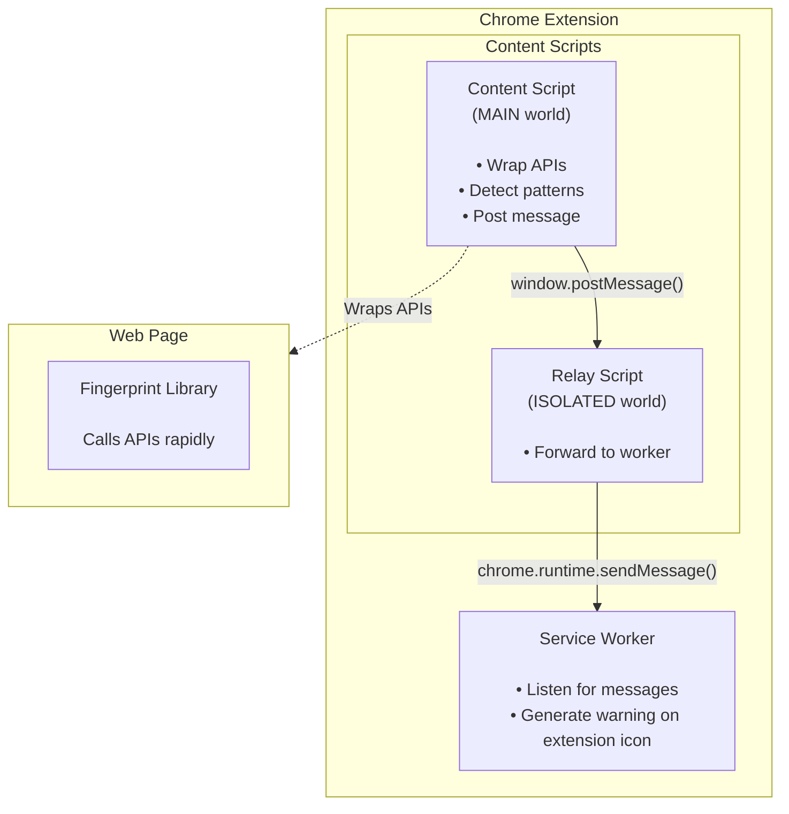

# Fingerprint Detection

A proof-of-concept Chrome extension that detects browser fingerprinting attempts in real time, paired with a small Vite + React app (using [FingerprintJS](https://github.com/fingerprintjs/fingerprintjs)) for testing it.

## How it works

Browser fingerprinting libraries generate a unique visitor ID by calling a cluster of native browser APIs in quick succession — canvas rendering, audio processing, WebGL parameters, etc. This extension detects that pattern by monkey-patching those APIs:

1. **Wrap native methods** — save a reference to the original method, then replace it on the prototype with a wrapper that logs the call before delegating to the original via `.apply(this, args)`.
2. **Track call timing** — each wrapped API records a timestamp when called.
3. **Flag the pattern** — if enough of the tracked APIs (`API_THRESHOLD`) fire within a short window (`FINGERPRINT_WINDOW`), the extension treats it as a likely fingerprinting attempt.

Currently wrapped APIs:

- `HTMLCanvasElement.prototype.toDataURL` (canvas fingerprinting)
- `OfflineAudioContext.prototype.startRendering` (audio fingerprinting)
- `WebGLRenderingContext.prototype.getParameter` (WebGL fingerprinting)

## Architecture



- **`extension/content.js`** — injected into the page's `MAIN` world at `document_start`. Wraps the target APIs and runs the detection logic.
- **`extension/relay.js`** — runs in the extension's `ISOLATED` world. Forwards detection messages from the page (via `window.postMessage`) to the service worker, since MAIN-world scripts can't call extension APIs directly.
- **`extension/background.js`** — the service worker. Sets a 🚨 badge and warning tooltip on the extension icon for the affected tab, and clears it on navigation.
- **`src/App.tsx`** — a minimal React page that runs FingerprintJS on demand, used to trigger and test the detection.

## Repo structure

```
extension/       Chrome extension (manifest v3)
  content.js       API wrapping + detection logic
  relay.js         Message relay (isolated world → service worker)
  background.js    Service worker (badge/tooltip warnings)
  manifest.json
src/               Vite + React test app
  App.tsx           Runs FingerprintJS.load() on button click
```

`src/` and `extension/` are two independent pieces that don't build into each other — there's no single "rebuild" step that covers both. Which reload workflow you need depends on which one you changed:

| You edited... | What to do |
| --- | --- |
| `src/App.tsx` (or anything else under `src/`) | Nothing extra — the Vite dev server (`npm run dev`) hot-reloads it automatically. |
| `extension/content.js`, `background.js`, `relay.js`, or `manifest.json` | Go to `chrome://extensions` and click the reload icon (↻) on the extension's card, then refresh the page you're testing on. |

## Building the extension

The extension is unpacked/unbundled — plain JS files loaded directly by Chrome via `manifest.json`, with no build step of its own (unlike the React app, which goes through Vite). It's declared as a **Manifest V3** extension with three moving pieces wired together in `extension/manifest.json`:

```json
"content_scripts": [
  { "matches": ["http://*/*", "https://*/*"], "js": ["content.js"], "run_at": "document_start", "world": "MAIN" },
  { "matches": ["http://*/*", "https://*/*"], "js": ["relay.js"],   "run_at": "document_start" }
],
"background": { "service_worker": "background.js" },
"permissions": ["tabs"]
```

- **`world: "MAIN"` vs. the default `"ISOLATED"` world** — Chrome extension content scripts normally run in an isolated JS context that shares the page's DOM but not its `window` object, so they can't see or patch variables/prototypes the page defines. `content.js` opts into `"MAIN"` so it executes in the *same* JS context as the page itself — this is required for prototype patching (`HTMLCanvasElement.prototype.toDataURL = ...`) to actually affect the calls the page makes. The trade-off is that MAIN-world scripts lose access to `chrome.*` extension APIs, which is why `relay.js` exists as a second, isolated-world content script running alongside it.
- **`run_at: "document_start"`** — both scripts are injected before the page's own scripts run, so the API wrapping in `content.js` is in place *before* any fingerprinting library (like FingerprintJS) has a chance to call the native methods.
- **`permissions: ["tabs"]`** — needed so `background.js` can resolve `sender.tab.id` and set the badge/tooltip on the correct tab.
- **No `action.default_popup`** — `"action": {}` gives the extension a toolbar icon without a popup UI; all feedback is the badge text/tooltip set by `background.js`.
- **Icons** — `extension/images/icon-{16,32,48,128}.png`, referenced by size in the manifest as Chrome requires.

Because there's no bundler, editing any of `content.js`, `relay.js`, `background.js`, or `manifest.json` just requires reloading the extension (see step 2 below) — no rebuild step.

## Usage

### Prerequisites

- Node.js and npm (for the React test app)
- Google Chrome (or another Chromium-based browser supporting Manifest V3)

### 1. Clone the repo

```
git clone https://github.com/seancvr/fingerprint_detection.git
cd fingerprint_detection
```

### 2. Load the extension

Go to `chrome://extensions`, enable **Developer Mode** (top right), click **Load unpacked**, and select the `extension/` directory. See Chrome's [load an unpacked extension guide](https://developer.chrome.com/docs/extensions/get-started/tutorial/hello-world) for details.

<p align="center">
  
</p>

The extension's icon will appear in the Chrome toolbar. It runs automatically on every page you visit — no configuration needed.

If you make changes to any extension file, go back to `chrome://extensions` and click the reload icon on the extension's card to pick up the changes.

### 3. Run the React test app

Install dependencies and start the Vite dev server:

```
npm install
npm run dev
```

Open `http://localhost:5173/` in Chrome. You should see the app running alongside the installed extension.

<p align="center">
  
</p>

### 4. Trigger detection

Open the DevTools console (`Cmd+Option+J` / `Ctrl+Shift+J`) so you can see the detection logs, then click **Get browser fingerprint**. This calls `FingerprintJS.load()` and `fp.get()`, which internally invoke the canvas/audio/WebGL APIs the extension is watching.

You should see:

- Console logs for each wrapped API call (e.g. `canvas.toDataURL detected`), followed by `🚨 LIKELY FINGERPRINTING DETECTED 🚨` once the threshold is met
- A 🚨 badge on the extension's toolbar icon, with a warning tooltip on hover
- The app itself rendering the generated `visitorId` and confidence `score`

<p align="center">
  
</p>

The extension resets its detection state after a few seconds of inactivity (`SESSION_TIMEOUT`), so clicking the button again will re-trigger detection.

### Other useful scripts

```
npm run build     # type-check and build the React app for production
npm run lint      # run ESLint
npm run preview   # preview the production build locally
```

## References

- [FingerprintJS](https://github.com/fingerprintjs/fingerprintjs)
- [Fingerprint.com Engineering Blog](https://fingerprint.com/blog/tag/engineering/) — [canvas fingerprinting](https://fingerprint.com/blog/canvas-fingerprinting/), [audio fingerprinting](https://fingerprint.com/blog/audio-fingerprinting/)
- [Brave Browser — Fingerprinting Protections](https://github.com/brave/brave-browser/wiki/Fingerprinting-Protections)
- [Chrome Extensions — Content Scripts](https://developer.chrome.com/docs/extensions/develop/concepts/content-scripts)
