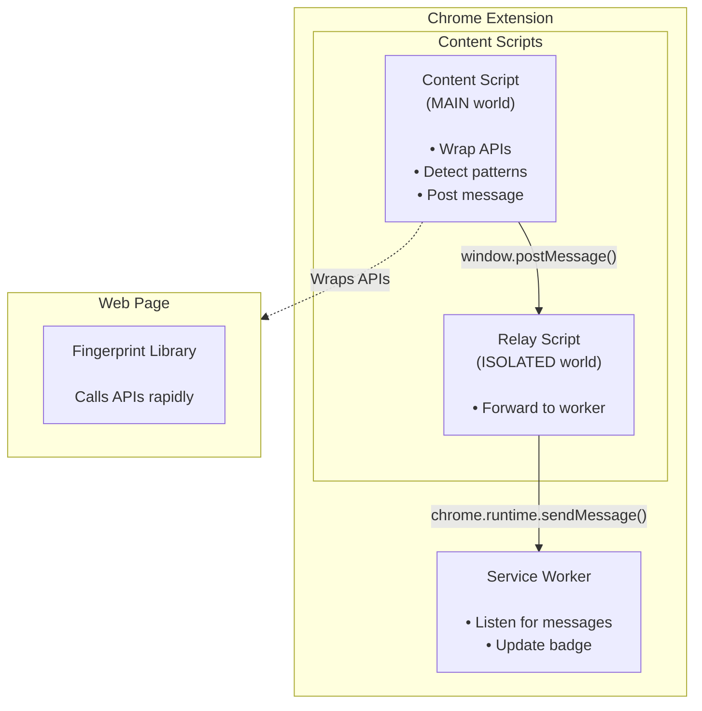

# Fingerpint Project

I wanted to learn more about browser fingerpinting, and decided to spend some time on a project that would build my understaning of the technology. For the purposes of this project I narrowed down the scope of my curiosity to two basic questions:

1. How does browser fingerprinting work.
2. Can it be detected.

The rest of this write up is about the approach I took to implement a solution that attempts to answer those questions.

## FingerprintJS library

The specific library I chose to use is [**FingerpirntJS**](https://github.com/fingerprintjs/fingerprintjs). It's an open-source, client-side browser fingerprinting library that creates unique visitor identifiers. It generates stable visitor IDs by collecting and hashing browser attributes.

To get a better understanding of specific fingerprinting techniques I started of by reading some of the engineering blog articles on [fingerprint.com](https://fingerprint.com/blog/tag/engineering/) (see references) which provided decent intro.
Next I spent some time looking at the **fingerprintjs** library. I made a local clone of the repo and then used [Claude Code](https://code.claude.com/docs/en/common-workflows#get-a-quick-codebase-overview) to get an overview of the structure. Below is the useful parts of the high level summary it provided me to work with.

### Project Structure

- **src/** - Source code (~3,800+ lines)
  - **src/sources/** - 40+ entropy collection modules (canvas, fonts, WebGL, audio, etc.)
  - **src/utils/** - Utilities for async ops, browser detection, hashing
  - src/agent.ts - Core fingerprinting agent
  - src/index.ts - Public API
- **playground/** - Development playground with hot reload
- **tests/** - Integration tests (Karma + Jasmine + BrowserStack)
- **docs/** - API docs, migration guides, browser support

### Execution Flow

The two-phase pattern (`load()` then `get()`).

```
FingerprintJS.load()
    ↓
prepareForSources() - Wait 50ms for browser stability
    ↓
loadSources() - Load all 40+ entropy sources in parallel
    │
    ├─ Audio: Create AudioContext, start rendering
    ├─ Fonts: Create iframe, measure font widths
    ├─ Canvas: Draw shapes, extract pixel data
    ├─ WebGL: Query GPU parameters
    └─ ... 36+ more sources
    ↓
Return Agent object { get() }
    ↓
─────────────────────────────────────────
    ↓
fp.get()
    ↓
Execute all component getters
    ↓
Collect components: { audio: {...}, canvas: {...}, fonts: {...}, ... }
    ↓
Return GetResult with lazy visitorId getter
    ↓
─────────────────────────────────────────
```

## Chrome Extensions

I chose to build the detection solution as a [Chrome Extension](https://developer.chrome.com/docs/extensions/get-started). Mostly because I had already spent some time learning the basics of chrome extensions and I knew they could listen for events, inject scripts into the browser and generate alerts.

## Architecture with the Extension approach



## Fingerprint detection logic

Elaborate here...

---

Check references for this:
The wrapper method is exactly what **Brave Browser**, **Firefox with resistFingerprinting**, and **Safari** do!

# References

[Fingerprint.com - Audio fingerprinting](https://fingerprint.com/blog/audio-fingerprinting/)

[Fingerprint.com - Canvas fingerprinting](https://fingerprint.com/blog/canvas-fingerprinting/)
